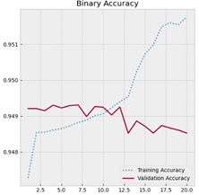
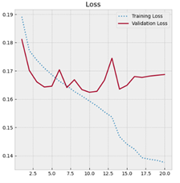
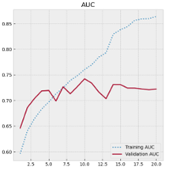
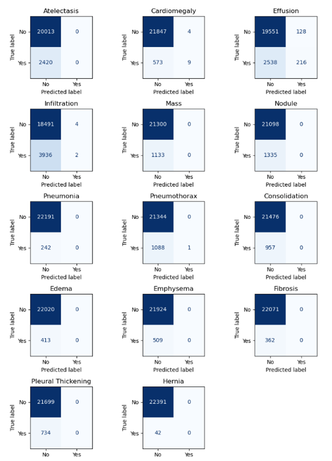

# Automated Thoracic Disease Detection with CNNs

Taher Akolawala 

### Abstract

   This project explores the development of a Convolutional Neural Network (CNN) to automate the detection of 14 distinct thoracic diseases using the ChestMNIST dataset. In the face of increasing radiologist workloads, automated systems offer a potential solution for prioritizing critical cases. I trained a custom CNN on 28 X 28 grayscale X-ray images, utilizing adaptive learning rates and early stopping to optimize performance. The final model achieved a Test Area Under the Curve (AUC) of 0.7353 and a Binary Accuracy of 94.77%. However, a detailed analysis of confusion matrices reveals significant sensitivity issues driven by dataset imbalance. While the model excels at identifying healthy patients, it struggles to detect rare pathologies. With this in mind, I propose using the system trained with the limitations of the dataset in mind, to be used as a tool that can speed up workflows of radiologists.

## Introduction

   Chest X-ray interpretation is one of the most important tasks done in diagnostic medicine. Increasingly, however, the large volume of imaging data outpaces that capacity of radiology teams, which leads to delays in results and fatigue related errors. 

   This problem can be framed as a multi-label classification task, where a single X-ray can show evidence of multiple conditions. In this dataset the 14 possible conditions were: Atelectasis, Cardiomegaly, Effusion, Infiltration, Mass, Nodule, Pneumonia, Pneumothorax, Consolidation, Edema (Oedema), Emphysema, Fibrosis, Pleural Thickening, and Hernia. 

   Using the ChestMNIST dataset provided, which is a derivation of the NIH-ChestXray14 dataset, a deep learning solution was implemented to predict the probability of the 14 different diseases listed above simultaneously. 

## Methodology
   ### Data Preprocessing

   The dataset comprises 112,120 frontal-view X-ray images, split into training (78,468), validation (11,219), and testing (22,433) sets. The images were provided in a heavily down sampled resolution of 28 X 28 pixels. To prepare the data for the CNN, two critical steps were taken:

   1. Normalization: Pixel intensities were scaled from [0,255] to [0,1] to ensure faster convergence during gradient descent. 
   2. Dimension Expansion: Tensorflow’s Conv2D layers requires 4 dimensional input data in the format (Batch, Height, Width, Channel). To  accommodate this, I expanded the raw (N, 28, 28) arrays to (N, 28, 28, 1) to show that the images are in grayscale.

   ### CNN Architecture

   A custom sequential CNN architecture was developed tailored to this low resolution dataset. Although a much larger model like ResNet50 may have done marginally better, it would not have been efficient and would also be massively prone to overfitting on simple 28 X 28 images. 

   - Feature Extraction: 3 convolutional blocks increasing in depth (32, 64, 128 filters) were used. I chose small 3 by 3 kernels to capture fine local details that are often not visible to the naked eye like tissue edges. Each convolutional block was followed by batch normalization to stabilize training and max pooling to reduce spatial dimensions.
   - Classification Head: The features were flattened and passed through a Dense layer (256 units) with Dropout (0.5). This regularization technique randomly ignores 50% of neurons during training, and forced the network to not memorize noise. 
   - Output Layer: The final layer consists of 14 neurons with a Sigmoid activation function. Sigmoid was used because it outputs an independent probability from 0 to 1 for each disease unlike other activation functions like SoftMax which forces probabilities to sum to 1. This made Sigmoid optimal for multi label classification. 

   The explicit model architecture table is shown below:

   | Layer Type                         | Output Shape           | Param # |
   |-----------------------------------|------------------------|---------|
   | Conv2D (32 filters, 3x3)           | (None, 28, 28, 32)     | 320     |
   | Batch Normalization                | (None, 28, 28, 32)     | 128     |
   | MaxPooling2D                       | (None, 14, 14, 32)     | 0       |
   | Conv2D (64 filters, 3x3)           | (None, 14, 14, 64)     | 18,496  |
   | Batch Normalization                | (None, 14, 14, 64)     | 256     |
   | MaxPooling2D                       | (None, 7, 7, 64)       | 0       |
   | Conv2D (128 filters, 3x3)          | (None, 7, 7, 128)      | 73,856  |
   | Batch Normalization                | (None, 7, 7, 128)      | 512     |
   | MaxPooling2D                       | (None, 3, 3, 128)      | 0       |
   | Flatten                            | (None, 1152)           | 0       |
   | Dense                              | (None, 256)            | 295,168 |
   | Dropout (0.5)                      | (None, 256)            | 0       |
   | Dense (Output)                     | (None, 14)             | 3,598   |

   - Total Parameters: 392,334 
   - Trainable Parameters: 391,886
   - Non-trainable Parameters: 448

   ### Training Strategy

   The model was compiled with the Adam optimizer with an initialized learning rate of 0.001 and Binary Cross entropy used as a loss function. Other best practices used were: 

   1. Early Stopping: To prevent overfitting, training stopped if Validation AUC did not improve for 10 epochs.
   2. ReduceLROnPlateau: The learning rate was reduced by a factor of 0.2 if the model stagnated, allowing it to fine-tune weights in smaller steps.
   3. ModelCheckpoint: Only the model weights with the highest Validation AUC were saved.

## Experimental Results
   ### Quantitiative Performance

   Although max epochs were set to 50, the training process lasted 20 epochs before early stopping was triggered. The best model saved was from epoch 10. It had the following performance on the test set:

   - Loss: 0.1667
   - Binary Accuracy: 94.77%
   - AUC: 0.7353

   The high accuracy of roughly 95% was initially impressive, however it is slightly misleading. Upon more analysis of the dataset, it was observed that roughly 40% of the dataset images were just 3 classes. As seen later in the confusion matrix, because of this, the model is much better at predicting if a patient is healthy compared to if they have a specific disease. Keeping this in mind, it would be advisable to keep AUC (0.7353) as a much more reliable metric, indicating that the model has a moderate ability to distinguish between positive and negative cases. 

   ### Learning Curves
   The learning curves illustrate the dynamics of training. As seen in Figure 3 (below), the Training AUC (dotted line) continues to rise indefinitely, while the Validation AUC (solid line) plateaus around Epoch 10. This divergence is a classic signature of overfitting; the model began memorizing the training data rather than generalizing. The Early Stopping callback successfully prevented this by restoring the weights from Epoch 10.

   Additionally, the loss curves support this diagnosis. While training loss decreased across all epochs, validation loss had more of u shape, and it reached a global minimum at Epoch 10. The rising validation loss confirms that the model began to diverge from the ground truth on unseen data after epoch 10. Notably, binary accuracy continued to rise across all epochs, and there was only a marginal difference between the final validation and training binary accuracy values. This stability can only be attributed to the severe class imbalance. The model is able to achieve high accuracy by predicting the majority classes, which, as mentioned before, makes AUC a much better metric than accuracy for this specific case. 

   |  |  |  |
   |:--------------:|:--------------:|:--------------:|
   | Figure 1 | Figure 2 | Figure 3 |
   | Binary Accuracy Learning Curve | Learning Curve for Loss Metric | Learning Curve for AUC |

   ### Quantitative Analysis: Confusion Matrices

   To observe why the AUC is only 0.73 despite a high accuracy, confusion matrices were plotted for all 14 diseases. The results show a severe class imbalance problem. For rare diseases like hernia, the model predicts ‘No’ for almost all images. It can be then assumed that the model has learned that predicting the patient is healthy is the statistically safest option. For example, in the infiltration matrix (which one of the most common diseases) the model was able to successfully identify many positive cases, but for hernia positive predictions were nonexistent. Such false negatives can be risky in a medical context. 

   |  |
   | :----------------------------------:|
   | *Figure 4: Confusion Matrices for all 14 diseases. Note the heavy concentration of predictions in the "No" columns, indicating the model favors specificity over sensitivity due to dataset imbalance.*|

## Implementation and Usage Discussion
   ### Limitations and Potential Use Case

   The current limitations for the model are the dataset characteristics. First that the resolution is only 28 by 28 which makes it insufficient for the purposes of radiology. Nodules become hard to decipher from noise. The second limitation is the class imbalance. Ideally, there would be a much larger selection of chest X-ray images for rarer diseases as well. 

   Despite the issues, it is still possible that the model can be used to make radiologist workflows more efficient. Instead of using the model for automatic diagnosis, it can be used for worklist prioritization. The model can output a probability score, and then an underlying radiology software can rank X-rays based on the risk scores outputted by the model. Patients with high predicted probabilities for severe conditions can be moved to the top of the radiologist’s queue of work. This would ensure that patients who are in need of more urgent care can get their results sooner. 

   ### Future Improvements

   To improve the model the following steps can be implemented on the same dataset:

   1. Weighted Loss Function: Class weights can be implemented during training to penalize the model more heavily for missing a positive case than for a false alarm.
   2. Data augmentation: For rarer diseases, the number of chest x-ray scans can be increases by rotating, zooming, or flipping the existing positive samples. 
   3. Higher resolution: This is self evident. Feature extraction on higher resolution data will be much easier and result in more valuable results. 

## Conclusion

   A CNN pipeline was successfully implemented for multilabel X-ray classification, achieving a test AUC of 0.7353. While the current model exhibits bias towards the majority classes in the data set, it can be easily improved with a larger, more diverse, dataset of higher resolution in conjunction with the improvements listed above. By doing so, the system can be used for automated diagnostics in radiology and significantly improve patient turnover times.

**To run the code**: Clone the github repository, open test.ipynb, and run all cells. The model should evaluate on the test set, and display performance metrics as well as confusion matrices for each disease.
**To use a different dataset**: Ensure the new data is has the shape (N, 28, 28) and that the images are grayscale. Open the training notebook and locate the second code cell. Replace the code:
`chestdata = np.load('[YOUR_DATA].npz')`. Then run all cells again. You can tweak the user parameters of learning rate, batch size, epochs, and architecture neuron counts if you wish. 
